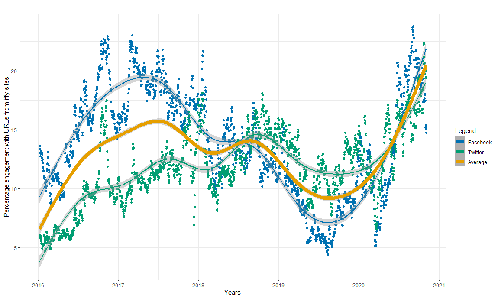
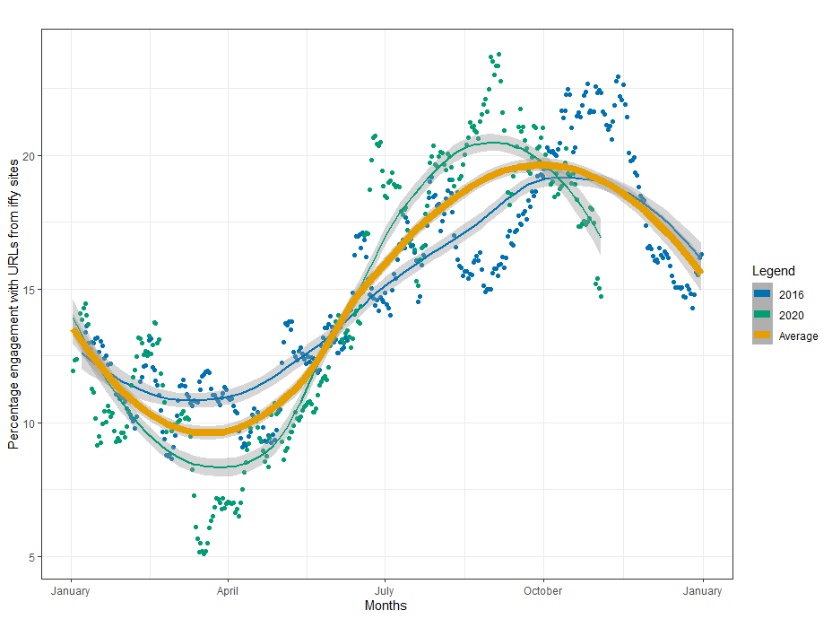

<h1>Data Analysis for <em>Tracking the Impact of Fake News on US Election Cycles</em></h1>

This project is a collection of R programming scripts used for data analysis of Iffy Quotient (news reliability) data provided by the Center for Social Media Responsibility at the University of
Michigan School of Information.

<a href="https://doi.org/10.1145/3462203.3475920"><em>Tracking the Impact of Fake News on US Election Cycles</em> (Full publication)</a>

Authors: Omar Alkhalili, Dr. Stefan A. Robila

Published with GoodIT '21, September 2021, Rome, Italy

Resources: <a href="https://csmr.umich.edu/projects/iffy-quotient/">Iffy Quotient</a>

Special thanks to Dr. Robila and to the Iffy Quotient researchers at the University of Michigan School of Information

<h3>Abstract</h3>

<em>Access to accurate information is paramount to sound decision-making, improves societal trust in governmental and civil society structures and builds civic unity. Disinformation impacts societies' well-being, physical and mental health, financial welfare and even the ability to withstand external aggression. Changes in the way that individuals acquire information resulted in new approaches to influence society. In politics, disinformation is a growing concern, threatening the credibility of democratic processes.</em>

<em>This paper investigated the degree to which misinformation was present during recent US election years by analyzing data on two major social media platforms. The findings show that such events are connected to increases in disinformation activity despite efforts taken by social media companies.</em>

<h3>Selected Figures</h3>

<h4>2016-2020 Facebook and Twitter Engagement-weighted Iffy Quotient</h4>

<h4>2016 and 2020 Facebook Engagement-weighted Iffy Quotient by Year</h4>

